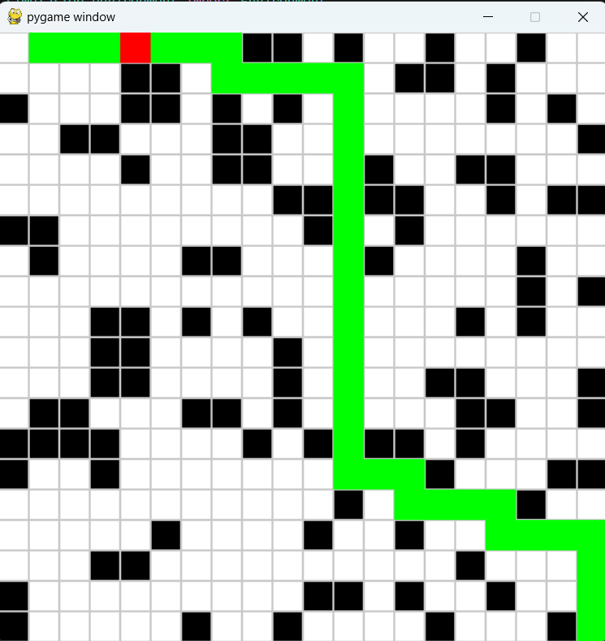
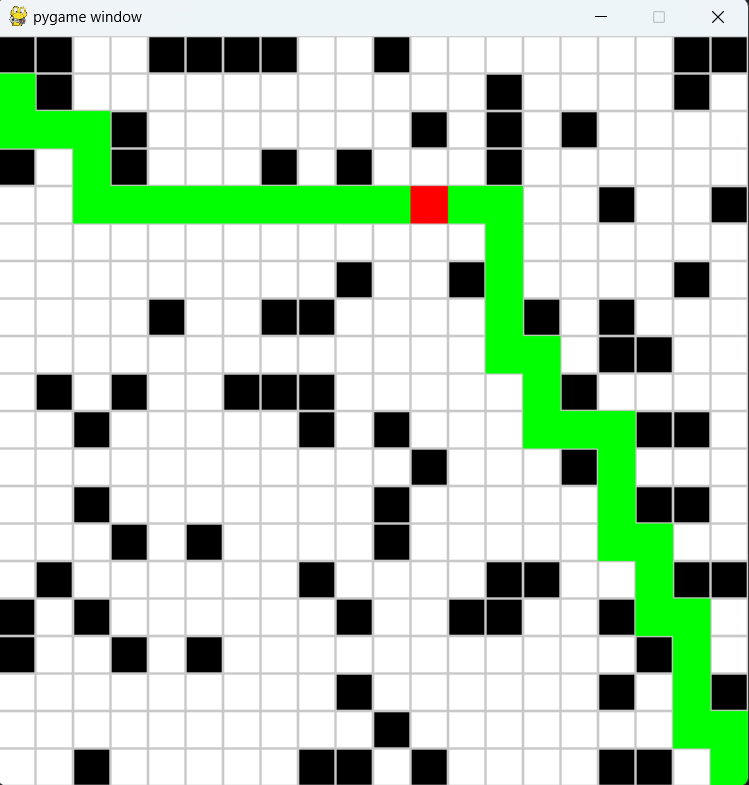
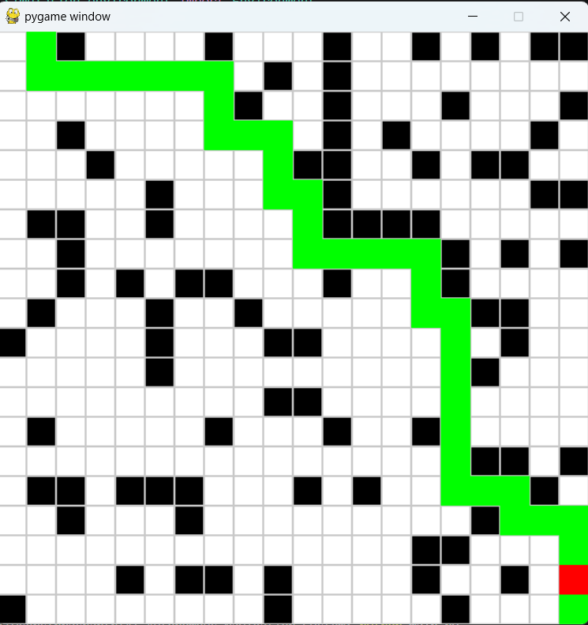
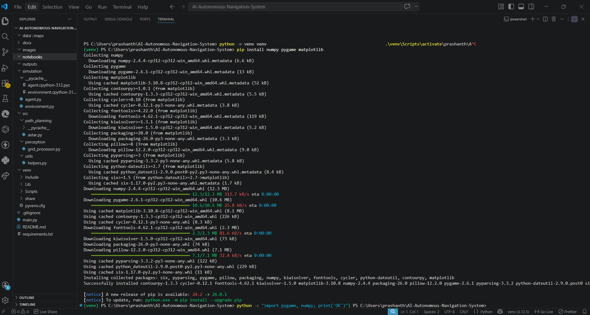

# 🚗 AI-Based Autonomous Navigation System

## 📌 Project Overview

This project demonstrates an **AI-Based Autonomous Navigation System** built using Python.
It simulates a virtual environment where an agent (vehicle) intelligently navigates from a start point to a goal while avoiding obstacles using the **A* path planning algorithm**.

The system mimics real-world autonomous navigation used in self-driving cars, robotics, and warehouse automation.

---

## 🎯 Problem Statement

Autonomous systems must navigate complex environments without human intervention.
This project solves the problem of:

* Finding the shortest path
* Avoiding obstacles
* Making intelligent movement decisions in a grid-based environment

---

## 🏭 Industry Relevance

This project is inspired by real-world systems used in:

* 🚗 Self-driving cars (Tesla, Waymo)
* 🤖 Warehouse robots (Amazon Robotics)
* 🚁 Drone navigation systems
* 📦 Delivery robots
* 🏭 Industrial automation systems

---

## ⚙️ Tech Stack

* **Python**
* **Pygame** (Simulation)
* **NumPy**
* **A* Path Planning Algorithm**

---

## 🧠 System Architecture

```text
Environment → Perception → Obstacle Detection → Path Planning (A*) → Navigation → Visualization
```

---

## 📂 Project Structure

```text
AI-Autonomous-Navigation-System/
│
├── images/                  # Screenshots for README
├── outputs/                 # Simulation outputs (images/videos)
│   ├── images/
│   └── videos/
│
├── simulation/              # Environment and agent logic
│   ├── environment.py
│   └── agent.py
│
├── src/
│   ├── path_planning/
│   │   └── astar.py
│   ├── perception/
│   │   └── grid_processor.py
│   └── utils/
│
├── main.py                  # Entry point
├── requirements.txt
├── README.md
└── .gitignore
```

---

## ⚙️ Installation

### 1️⃣ Clone the repository

```bash
git clone https://github.com/your-username/AI-Autonomous-Navigation-System.git
cd AI-Autonomous-Navigation-System
```

### 2️⃣ Create virtual environment

```bash
python -m venv venv
```

### 3️⃣ Activate environment

**Windows:**

```bash
venv\Scripts\activate
```

**Mac/Linux:**

```bash
source venv/bin/activate
```

### 4️⃣ Install dependencies

```bash
pip install -r requirements.txt
```

---

## ▶️ How to Run

```bash
python main.py
```

---

## 🧪 Simulation Workflow

1. Grid environment is generated
2. Obstacles are randomly placed
3. A* algorithm calculates shortest path
4. Agent follows computed path
5. Navigation is visualized using Pygame

---

## 📸 Results

### 🧱 Environment



### 🧠 Path Planning (A*)



### 🚗 Agent Navigation


### 🎯 Goal Reached



### 🖥️ Terminal Execution



---

## 🎥 Demo


---

## 🚀 Key Features

* ✔ Autonomous navigation in grid environment
* ✔ A* path planning implementation
* ✔ Obstacle avoidance
* ✔ Real-time simulation using Pygame
* ✔ Modular and scalable architecture

---

## 📈 Results

* Successfully computes shortest path
* Avoids obstacles efficiently
* Simulates real-time movement
* Demonstrates core robotics navigation pipeline

---

## 🔮 Future Improvements

* Integrate **YOLO object detection**
* Use **CARLA simulator** for realistic driving
* Implement **Dijkstra / BFS comparison**
* Add **multi-agent navigation**
* Implement **SLAM (Simultaneous Localization and Mapping)**
* Add **reinforcement learning-based navigation**

---

## 🎓 Learning Outcomes

* Understanding of autonomous navigation systems
* Implementation of A* path planning
* Simulation using Pygame
* Modular software design
* Real-world robotics concepts

---

## 👨‍💻 Author

**Prashanth Kulal**

* GitHub: https://github.com/Prashanth-Kulal1
* LinkedIn: www.linkedin.com/in/prashanth-kulal-10266328b

---

## ⭐ Support

If you like this project, consider giving it a ⭐ on GitHub!
